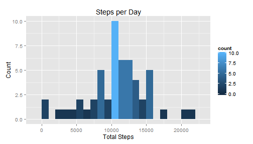
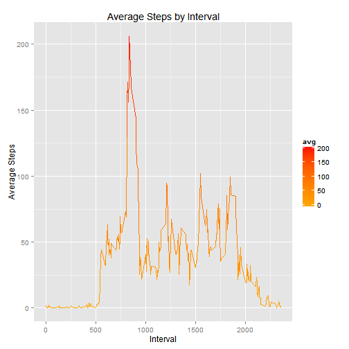
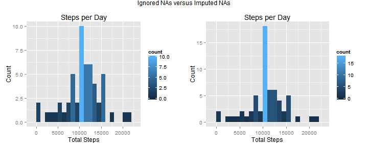
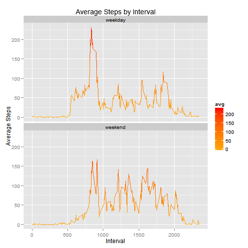

Greetings, classmates!

##Getting the data
First, let's get and load the data. This script will download the data
only if it doesn't exist already.


```r
if (!file.exists("~/R/repdata-data-activity.zip")) {
        fileurl <- "https://d396qusza40orc.cloudfront.net/repdata%2Fdata%2Factivity.zip"
        download.file(fileurl, "~/R/repdata-data-activity.zip")
        unzip("repdata-data-activity.zip")
}

activity <- read.csv("~/R/activity.csv")
head(activity)
```

```
##   steps       date interval
## 1    NA 2012-10-01        0
## 2    NA 2012-10-01        5
## 3    NA 2012-10-01       10
## 4    NA 2012-10-01       15
## 5    NA 2012-10-01       20
## 6    NA 2012-10-01       25
```
  

##Looking at the Distribution
Next, we want to see a histogram of the total number of steps taken each day. 
No problem! Let's tackle this by first creating a table of the total steps 
taken per day and then use the ggplot2 plotting system.  We'll need the dplyr
package, as well.


```r
require(dplyr)
require(ggplot2)
totalbyday <- activity %>% 
                group_by(date) %>% 
                summarise(total = sum(steps))
```


```r
originalhist <- ggplot(totalbyday, aes(x = total)) +
                geom_histogram(binwidth = 1000, aes(fill = ..count..)) +
                labs(title = "Steps per Day", x = "Total Steps", y = "Count")
originalhist
```

 

Now that we have our totalbyday object, it should be easy to calculate the mean
and median. There are a number of missing values in this data set that we will
ignore until later.


```r
mean <- format(mean(totalbyday$total, na.rm = TRUE), digits = 6)
median <- median(totalbyday$total, na.rm = TRUE)
```
  
As we can see, the mean is 10766.2 and the median is 10765.  

##Average Daily Activity
Next, we need to look at the average daily activity pattern.  To do that, we'll start by
using dplyr to create a data frame of the average daily steps taken per interval, then we'll
use ggplot2 to visualize the time series plot.


```r
byinterval <- activity %>% 
                group_by(interval) %>% 
                summarise(avg = mean(steps, na.rm = TRUE))
```


```r
originalTS <- ggplot(byinterval, aes(x = interval, y = avg)) +
                geom_line(aes(col = avg)) +
                scale_color_gradient(low = "orange", high = "red") +
                labs(title = "Average Steps by Interval", x = "Interval", y = "Average Steps")
originalTS
```

 

A little more dplyr magic will show us the busiest interval.


```r
busiestinterval <- byinterval %>% 
                        filter(avg == max(avg))
busiestinterval
```

```
## Source: local data frame [1 x 2]
## 
##   interval      avg
## 1      835 206.1698
```

```r
interval <- as.integer(busiestinterval[1])
steps <- as.integer(busiestinterval[2])
```
We can see the interval 835 is, on average, the busiest interval with the subject
taking 206 steps.  This interval corresponds to 
13:55 local time.  

##Dealing with Missing Values
Now we will address the missing values mentioned earlier in the analysis. And determine
how much they affect the analysis. Let's start by finding out exactly how many there are.


```r
badrows <- activity %>%
                filter(is.na(steps))
count(badrows)
```

```
## Source: local data frame [1 x 1]
## 
##      n
## 1 2304
```

It turns out there are 2304 missing values in the
original data set. We're going to impute these missing values by replacing
them with the average steps taken during that interval. You probably
recall that we already have all of that information in our "byinterval"
object. We also have all of the rows with missing data in our "badrows"
object. The approach I'm going to take, then, is to create a separate
data frame with all complete cases, impute the missing values in "badrows,"
and then combine the two into one data frame. The result will be identical
to the original "activity" data frame, but with all missing values replaced
appropriately.


```r
goodrows <- activity[!is.na(activity$steps), ]

temp <- left_join(badrows, byinterval, by = "interval")

improws <- select(temp, steps = avg, date, interval)

impactivity <- bind_rows(goodrows, improws) %>%
                arrange(interval) %>%
                arrange(date)
head(impactivity)
```

```
## Source: local data frame [6 x 3]
## 
##       steps       date interval
## 1 1.7169811 2012-10-01        0
## 2 0.3396226 2012-10-01        5
## 3 0.1320755 2012-10-01       10
## 4 0.1509434 2012-10-01       15
## 5 0.0754717 2012-10-01       20
## 6 2.0943396 2012-10-01       25
```
Voila. I'm very interested to see how the rest of you approached this problem,
because I feel like there must be an easier way. In any case, we may now
repeat the earlier analysis with the imputed data to see how the outcome
was affected by ignoring the missing values initially.  
To compare the before/after histograms, we're going to use a package called
gridExtra, which allows us to easily display our stored ggplot2 objects
side by side.

```r
imptotalbyday <- impactivity %>% 
                        group_by(date) %>% 
                        summarise(total = sum(steps))
```

```r
imphist <- ggplot(imptotalbyday, aes(x = total)) +
                geom_histogram(binwidth = 1000, aes(fill = ..count..)) +
                labs(title = "Steps per Day", x = "Total Steps", y = "Count")
```

```r
require(gridExtra)
grid.arrange(originalhist, imphist, ncol = 2, main = "Ignored NAs versus Imputed NAs")
```

 
We can see that imputing the missing values results in a much more narrow distribution
with a considerably higher average steps per day.  Let's compare how the mean and median
changed, also.

```r
impmean <- format(mean(imptotalbyday$total), digits = 6)
impmedian <- format(median(imptotalbyday$total), digits = 6)
```
As we can see, the mean changed from 10766.2 to 10766.2 and the median changed 
from 10765 to 10766.2. This virtually non-existent change is to be expected
since we filled in our missing values using the mean by interval.

##Activity Patterns
Finally, we would like to see whether activity patterns differ greatly from
weekdays to weekends. To do this, we will create a new column with a factor
variable indicating whether a given date is a weekday or not. We will fist
need to change the class of the date column from "factor" to "POSIX."


```r
impactivity$date <- as.POSIXct(impactivity$date)
impactivity <- impactivity %>%
                mutate(weekday = as.factor(weekdays(impactivity$date)))

summary(impactivity$weekday)
```

```
##    Friday    Monday  Saturday    Sunday  Thursday   Tuesday Wednesday 
##      2592      2592      2304      2304      2592      2592      2592
```
Now we just need to change the levels to weekday/weekend.

```r
levels(impactivity$weekday) <- 
        c("weekday", "weekday", "weekend", "weekend", "weekday", "weekday", "weekday")
summary(impactivity$weekday)
```

```
## weekday weekend 
##   12960    4608
```
We're going to do some rather ham-fisted binding/separating/reclassing to keep
things easy to manage with ggplot2.

```r
weekdaybyinterval <- impactivity %>% 
                        filter(weekday == "weekday") %>%
                        group_by(interval) %>% 
                        summarise(avg = mean(steps), weekday = "weekday")

weekendbyinterval <- impactivity %>% 
                        filter(weekday == "weekend") %>%
                        group_by(interval) %>% 
                        summarise(avg = mean(steps), weekday = "weekend")
head(weekdaybyinterval)
```

```
## Source: local data frame [6 x 3]
## 
##   interval        avg weekday
## 1        0 2.25115304 weekday
## 2        5 0.44528302 weekday
## 3       10 0.17316562 weekday
## 4       15 0.19790356 weekday
## 5       20 0.09895178 weekday
## 6       25 1.59035639 weekday
```

```r
head(weekendbyinterval)
```

```
## Source: local data frame [6 x 3]
## 
##   interval         avg weekday
## 1        0 0.214622642 weekend
## 2        5 0.042452830 weekend
## 3       10 0.016509434 weekend
## 4       15 0.018867925 weekend
## 5       20 0.009433962 weekend
## 6       25 3.511792453 weekend
```

```r
summarybyinterval <- bind_rows(weekdaybyinterval, weekendbyinterval)
summarybyinterval$weekday <- as.factor(summarybyinterval$weekday)
```
Now we have one data frame with the summary by interval *and* by weekday/weekend
that we can use to easily compare a time series of each interval using
the factor variable "weekday" as a facet wrap in ggplot2.


```r
ggplot(summarybyinterval, aes(x = interval, y = avg)) +
                geom_line(aes(col = avg)) +
                scale_color_gradient(low = "orange", high = "red") +
                facet_wrap(~ weekday, ncol = 1) + 
                labs(title = "Average Steps by Interval", x = "Interval", y = "Average Steps")
```

 

We can see clearly that weekdays show a spike of activity during the earlier part of
the day followed by periods of lower intensity, while weekends exhibit a much less
pronounced spike during the same time frame followed by periods of medium intensity
for the remainder of the day.
